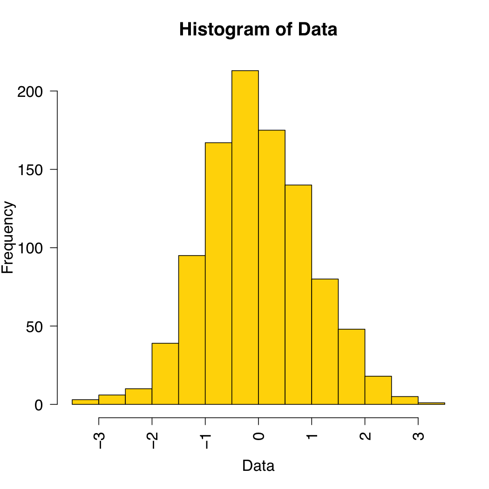
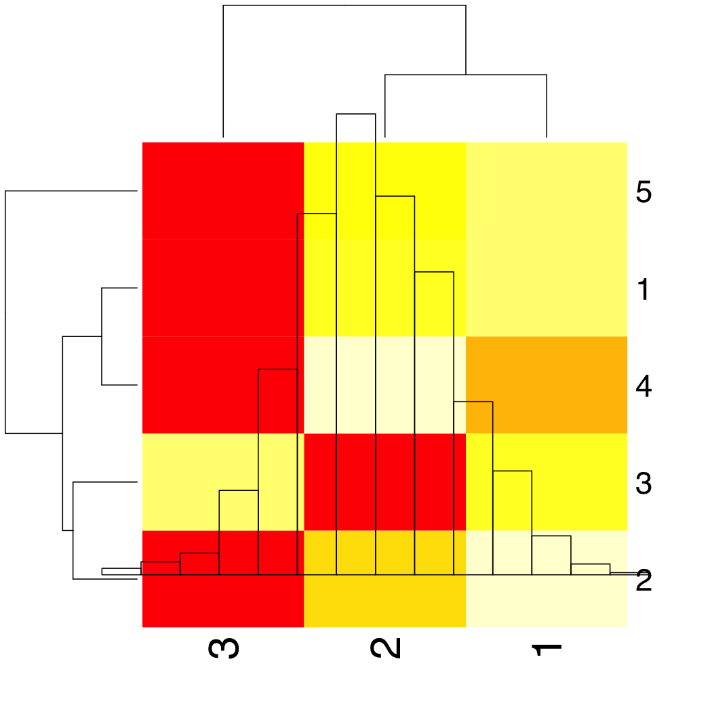

                   Modified: Mon Sep  7 15:38:09 2015

####  Settings

| | value  |
| ---| --- |
| Par1 	| 33  |
| Par3 	| 3  |

llogit command puts a line in the file, but do not print it

llprint command prints your to the terminal, giving immediate feedback.

This is useful if you parse sentences:

Par1 ( 33 ) is bigger than Par3 ( 3 )

# Start formatting: This is header 1

## This is header 2

 - This is a list

 - that goes on...

 - [This link shows you more of the MarkDown Syntax]("https://github.com/adam-p/markdown-here/wiki/Markdown-Cheatsheet")

## Start integrating your plotted results into the story

To integrate plots, you need to:

1. create the plot,

- save into a file, 

- and put a link into your report referring to the file.

This is all done at once with my wplot, whist, etc functions.

I do not have save_and_log plotting functions  for every plot you might want, so create your dream plot and then save it from the active device by: wplot_save_this function

## You can insert code if you wanna

`heatmap(matrix(Data, ncol=3,nrow = 5))`

`hist(Data, add=T)`

`wplot_save_this(plotname = "DreamMap", mdlink = T)`

`heatmap(matrix(Data, ncol=3,nrow = 5))

hist(Data, add=T)

wplot_save_this(plotname = "DreamMap", mdlink = T)`
